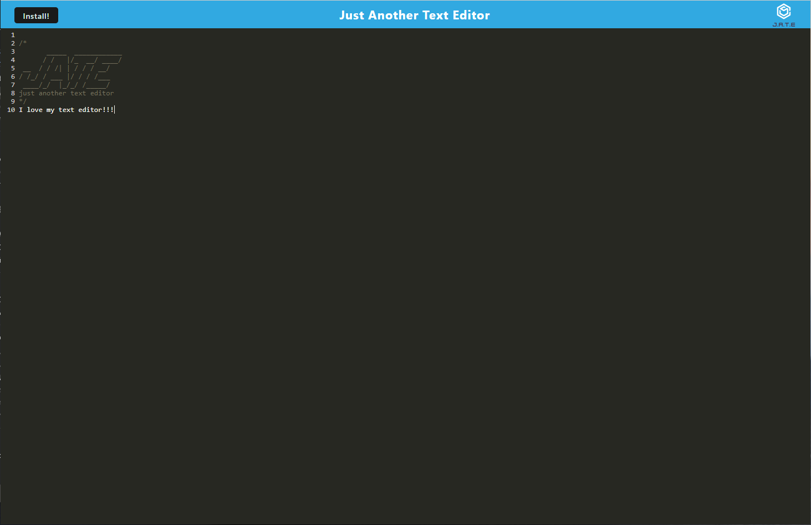

# Just Another Text Editor

## Table of contents
​
- [Overview](#overview)
  - [The challenge](#the-challenge)
  - [User Story](#user-story)
  - [Acceptance Criteria](#acceptance-criteria)
  - [Screenshot](#screenshot)
- [My process](#my-process)
  - [Built with](#built-with)
  - [What I learned](#what-i-learned)
  - [Continued development](#continued-development)
  - [Useful resources](#useful-resources)
- [Author](#author)
- [Acknowledgments](#acknowledgments)
​
​
## Overview
​
### The challenge
​
J.A.T.E. is a text editor setup to save javascript code snippets for easy reference.  This application meets the PWA, or Progressive Web Application, paradigm and is not only installable, but also able to run offline using cached resources in the browser.  This single page application utlizes the browser's IndexedDB database so that a user's data will persist with or without a connection.
​
### User Story
​
```md
AS A developer
I WANT to create notes or code snippets with or without an internet connection
SO THAT I can reliably retrieve them for later use
```
​
### Acceptance Criteria
​
```md
GIVEN a text editor web application
WHEN I open my application in my editor
THEN I should see a client server folder structure
WHEN I run `npm run start` from the root directory
THEN I find that my application should start up the backend and serve the client
WHEN I run the text editor application from my terminal
THEN I find that my JavaScript files have been bundled using webpack
WHEN I run my webpack plugins
THEN I find that I have a generated HTML file, service worker, and a manifest file
WHEN I use next-gen JavaScript in my application
THEN I find that the text editor still functions in the browser without errors
WHEN I open the text editor
THEN I find that IndexedDB has immediately created a database storage
WHEN I enter content and subsequently click off of the DOM window
THEN I find that the content in the text editor has been saved with IndexedDB
WHEN I reopen the text editor after closing it
THEN I find that the content in the text editor has been retrieved from our IndexedDB
WHEN I click on the Install button
THEN I download my web application as an icon on my desktop
WHEN I load my web application
THEN I should have a registered service worker using workbox
WHEN I register a service worker
THEN I should have my static assets pre cached upon loading along with subsequent pages and static assets
WHEN I deploy to Heroku
THEN I should have proper build scripts for a webpack application
```

​
​
### Screenshot

<br>




## My process
​
### Built with
​
- JavaScript
- NodeJS
- NPM express
- Webpack
- Workbox
​
### What I learned
​
Throughout the development of this project, I have found new modules/libraries that work with webpack and workbox.  A lot of these libraries have specific configurations, sometimes they are quite complex.  I got much better a reading documentation and slowing down to understand what I am doing/trying to do.  PWA setup is a topic that I will need to revisit with better focus and depth in the future.
​
### Continued development
​
With my new found knowledge of the PWA paradigm as well as the power of webpack, I am excited to implement these technologies on my past and future projects.  The webpack and workbox libraries are vast with many configuration settings; I want to play around with both of them more to understand how I can customize them to my needs.
​
### Useful resources
​
- [Webpack Docs](https://webpack.js.org/concepts/) - The webpack docs have all the information needed to get an application setup to use webpack.
- [Google's docs for workbox-webpack-plugin](https://developer.chrome.com/docs/workbox/modules/workbox-webpack-plugin/) - Google's docs are a little tricky to navigate, but they have all the information needed to setup workbox for a PWA application to function offline.

## Author
​
Nolan Spence
- Website - [Nolan Spence](https://unicorn-barf.github.io/Portfolio_Website_HTML_CSS/)
- LinkedIn - [https://www.linkedin.com/in/aerospence/](https://www.linkedin.com/in/aerospence/)
​
## Acknowledgments

Thank you to my classmate Asha Chakre for talking about concepts and ideas on how to tackle this project.